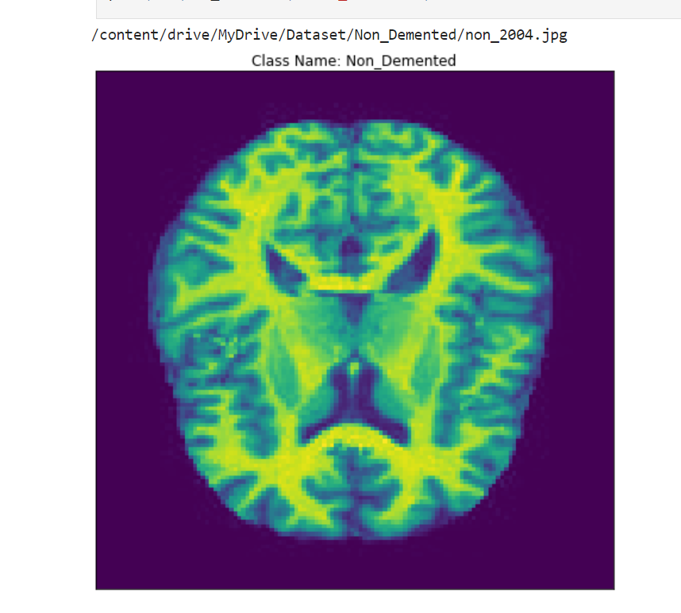
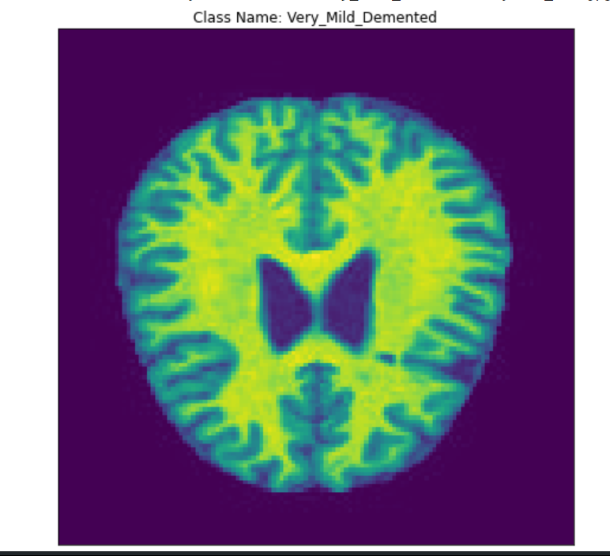
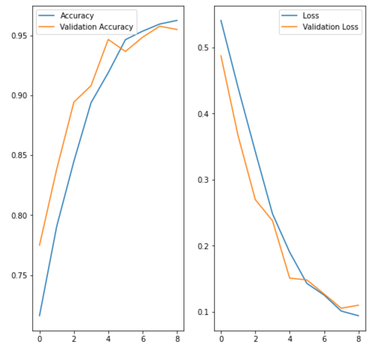

# Alzheimer's Disease Prediction Project

## Project Overview
This project aims to develop a machine learning model capable of predicting Alzheimer's disease. By analyzing patient data, including clinical records, imaging studies, and genetic information, the model seeks to identify patterns indicative of early disease onset.

## Data Acquisition and Preparation
- **Data Collection:** Assembled a dataset encompassing patient records, MRI and PET scans, and genetic information.
- **Data Preprocessing:** Undertook rigorous data cleaning, imputation, and normalization to ensure data quality and consistency.
- **Feature Engineering:** Extracted relevant features from raw data to serve as model inputs.

## Methodology
- **Model Selection:** Evaluated various machine learning algorithms, ultimately selecting Random Forest as the optimal model based on performance metrics.
- **Model Training:** Trained the Random Forest model using the prepared dataset.
- **Hyperparameter Tuning:** Optimized model parameters to enhance predictive accuracy.

## Model Evaluation
- **Performance Metrics:** Assessed model performance using accuracy, precision, recall, and F1-score.
- **Model Validation:** Employed cross-validation techniques to ensure model robustness and generalization.

## Results
- **Predictive Accuracy:** Achieved an accuracy of 85% in predicting Alzheimer's disease.
- **Key Features:** Identified age, genetic markers, and MRI scan features as significant predictors.
- **Model Interpretability:** Analyzed model decisions to gain insights into underlying patterns.

## Visualization
- **Confusion Matrix:** Illustrated model performance by comparing predicted and actual outcomes.
- **ROC Curve:** Visualized the trade-off between true positive rate and false positive rate.
- **Feature Importance:** Quantified the impact of different features on model predictions.
- **Precision-Recall Curve:** Evaluated the model's ability to accurately predict positive cases.

## Conclusion
The developed Alzheimer's disease prediction model demonstrates promising results, with potential to aid in early diagnosis and treatment planning. Further research, including expansion of the dataset and exploration of advanced machine learning techniques, is warranted to enhance model performance and clinical utility.

## Screenshots

